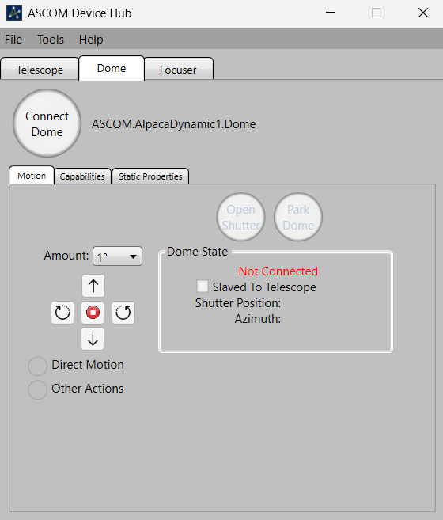
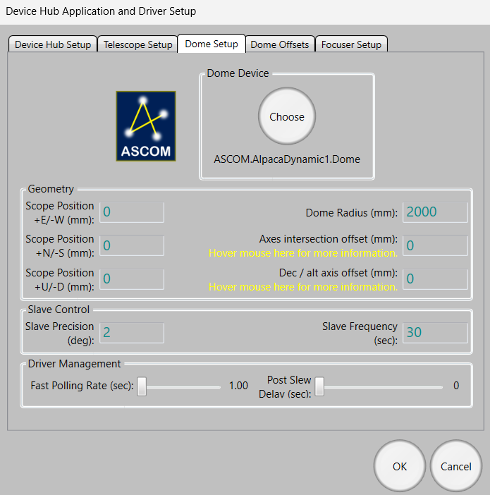
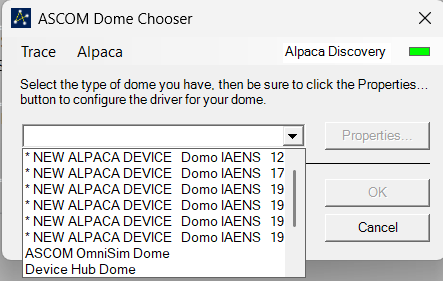
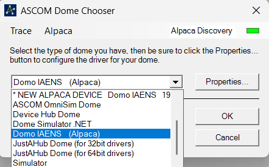
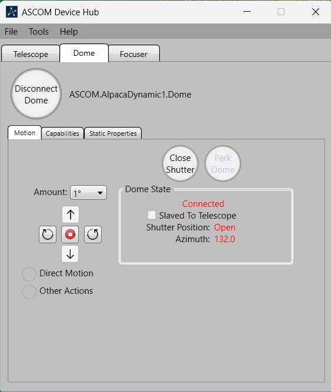
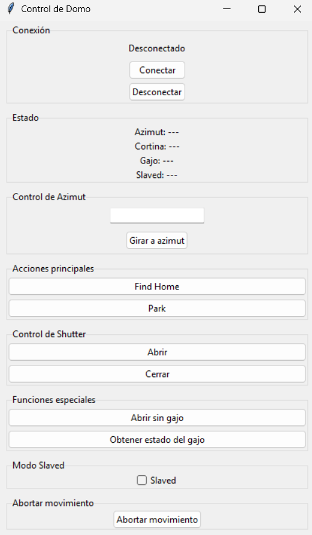

# First Startup

This document describes the procedure for starting the Observatory Dome Controller for the first time.

## Before Starting

Before launching the software, verify that:

- The Mosquitto service is running.
- The dome electronics are powered on.
- The dome is manually positioned at its **Home** position.

---

## Start the Alpaca Server

Open a terminal and navigate to the `alpaca-server` directory.

Activate the virtual environment:

```powershell
.\.venv\Scripts\Activate.ps1
```

Start the server:

```powershell
python main.py
```

Wait 5 seconds for the server to report that both ESP32 controllers are connected.

Expected output:

```text
Both devices online
```

**Important:** If the server reports that one or both ESP32 controllers are offline after startup, disconnect and reconnect the power supply of the corresponding controller. This is occasionally required when the control computer has been replaced or restarted.

---

## Configure ASCOM Device Hub

Open **ASCOM Device Hub**.



Navigate to **Dome → Tools → Setup**.



Press **Choose...**.

In the **ASCOM Dome Chooser** dialog:

1. Select **Alpaca**.
2. Click **Enable Discovery**.
3. Wait until one or more entries beginning with:

```text
* NEW ALPACA DEVICE  Domo IAENS
```

appear in the device list.

If multiple entries are displayed, any of them can be selected.



Click **OK**.

Windows may request administrator privileges to create the Alpaca dynamic driver. Approve the request.

After the driver has been created, the selected device will appear in the list as:

```text
Domo IAENS (Alpaca)
```



Select it and press **OK**.

The **Dome Device** field should now contain something similar to:

```text
ASCOM.AlpacaDynamic1.Dome
```

Close the configuration window by pressing **OK**.

---

## Connect to the Dome

From the Device Hub main window, click **Connect Dome**.

If the connection is successful, Device Hub should display:

- Connected status
- Dome azimuth
- Shutter status

If the azimuth is shown as **Unavailable**, the dome has not yet been referenced.

Open the **Direct Motion** tab and click **Go To Home**.

If the dome is already positioned at Home, it will not move. However, the controller will still detect the Home sensor and establish the physical reference position.

After homing, the current azimuth should become available.

The dome is now ready for operation. Device Hub can be used to perform standard ASCOM dome operations, including:

- Go to Azimuth
- Open/Close Shutter
- Find Home
- Park
- Slew



---

## Using the Custom Graphical Interface

Device Hub supports most dome operations.

However, this observatory requires additional functions that are not part of the ASCOM Dome standard, including:

- Opening the shutter without the flap.
- Reading the flap position.

These functions are available through the custom graphical interface.

Navigate to the `gui` directory.

Activate its virtual environment:

```powershell
.\.venv\Scripts\Activate.ps1
```

Start the application:

```powershell
python gui.py
```

A Tkinter window will open.

Press **Connect** to establish communication with the Alpaca server.

The additional controls can then be used to:

- Open the shutter without the flap.
- Read the flap position.



---

## Next Step

Continue with **06-dome-configuration.md**.